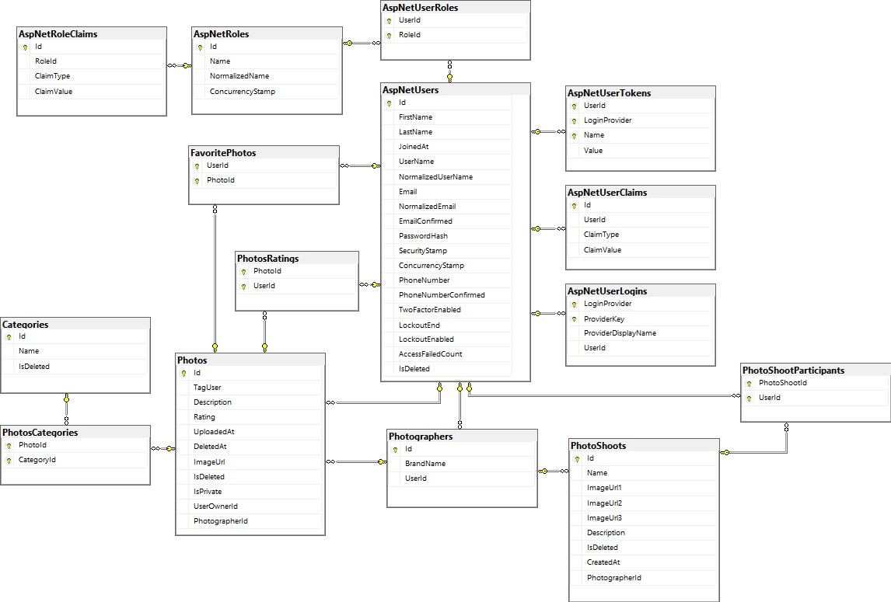
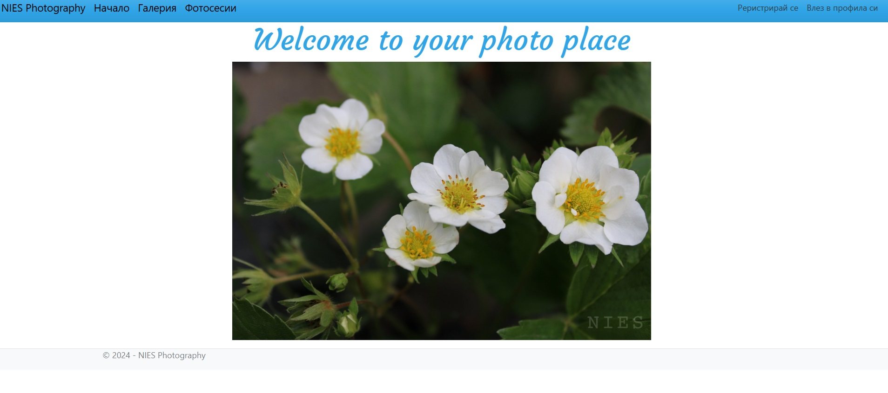
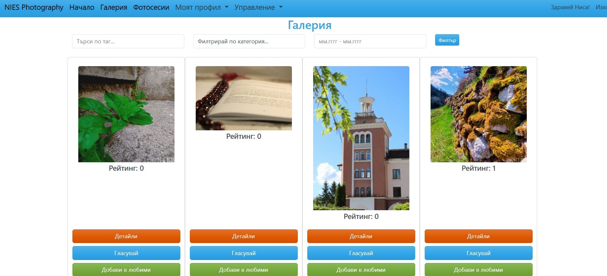
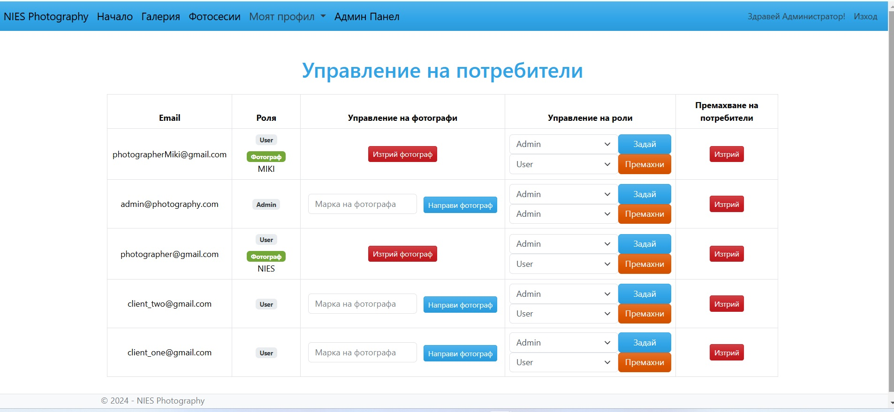

# 🌟 NIES Photography Web Application

## 📸 Overview
The NIES Photography Web Application is a platform crafted to empower photographers by showcasing their work and enabling seamless client interaction. Developed using the MVC framework, it offers robust features for uploading, categorizing, and rating photos, managing photoshoots, and sharing private photo collections with specific users. This platform is designed to deliver a visually engaging and user-friendly experience for both administrators (photographers) and general users.

---

## 📋 Features

### 🏷️ User Roles

#### 👤 User
- Browse and explore publicly shared photos uploaded by photographers.
- Save favorite photos for quick access later.
- Rate photos to show appreciation.
- View private albums shared exclusively with them.
- Register for photoshoots and participate in scheduled events.
- Filter photos by categories, tags, and upload dates.

#### 📸 User with Photographer Access
- Upload photos with options for multiple categories and flexible visibility (public or private).
- Create photoshoots for users to join and participate in.
- Assign private photos to specific users, ensuring exclusive access.
- Edit and delete photoshoots and photos in their portfolio.

#### 🛠️ Administrator
- Edit and delete photos and photoshoots across the platform.
- Manage user interactions, including ratings and favorite lists.
- Assign, edit, and remove roles for users.
- Delete users when necessary.
- Create, edit, and delete photo categories to ensure proper organization.

---

## 🗂️ Database Structure

The application is supported by a well-designed database that handles:
- Users, roles, and permissions.
- Photos, categories, tags, and visibility settings.
- Photoshoots and participant tracking.
- User interactions, including ratings and favorites.

---

## 💻 Technologies
- **Backend**: ASP.NET Core with the MVC architecture.
- **Frontend**: Razor Pages styled using Bootstrap 5 for modern and responsive design.
- **Database**: MS SQL Server for data storage and management.
- **Testing**: NUnit framework for reliable unit and integration testing.

---

## 🔐 Security
- **Role-Based Access Control**: Enforces secure access based on user roles.
- **Data Privacy**: Ensures users can only access photos they are permitted to view.
- **CSRF Protection**: Safeguards forms with AntiForgery tokens.
- **Input Validation**: Server-side and client-side validation of the data.
- **Soft Delete**: Supports recoverable deletion for critical data such as photos, photoshoots, and users.

---

## 📄 License
The Photography Services Web Application is licensed under the MIT License. Refer to the LICENSE.md file for further details.

---

##  **The app is still under construction**

---

